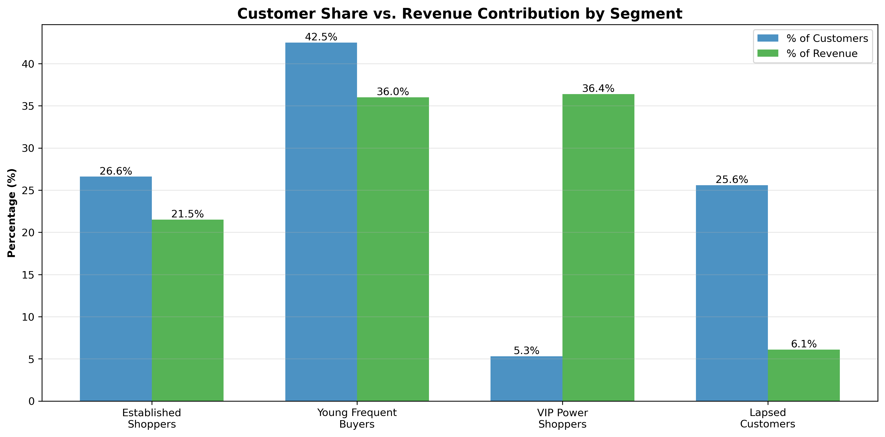
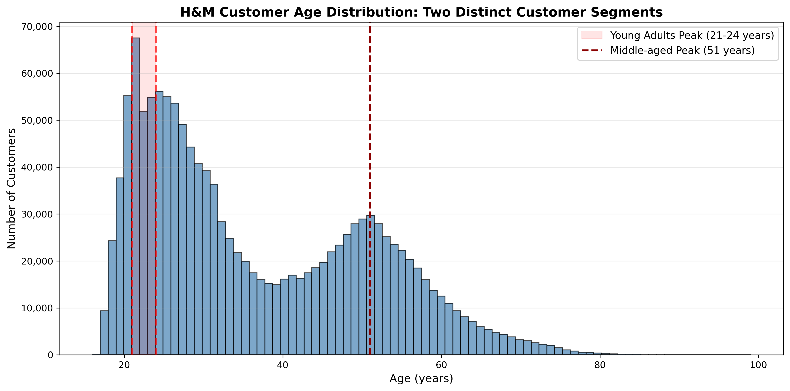
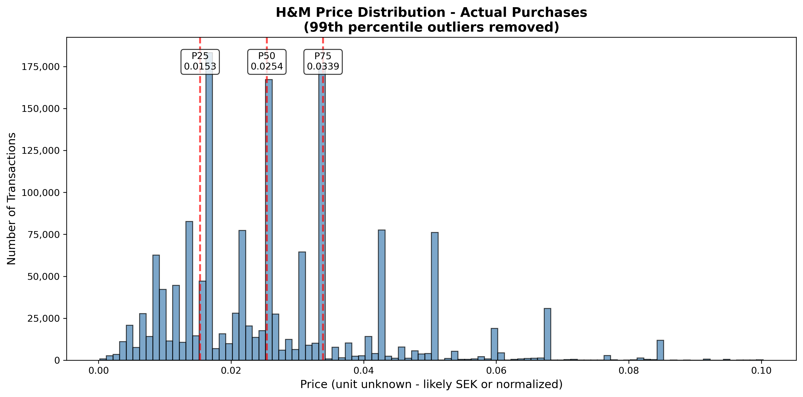
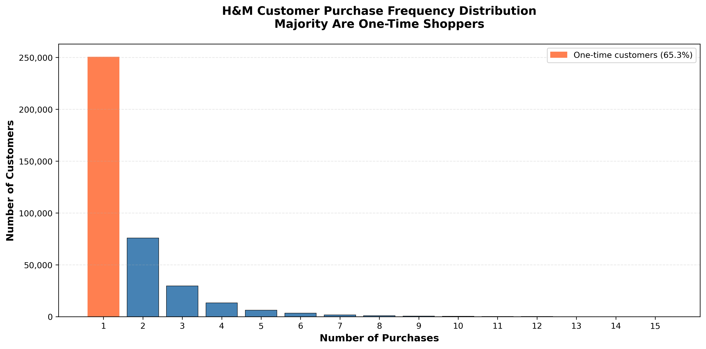

# 🛍️ Customer Intelligence Through Fashion: H&M Data Analytics Case Study

[](https://www.python.org/)
[](https://pandas.pydata.org/)
[](https://scikit-learn.org/)

## 🎯 Executive Summary

I analyzed **31+ million transactions** from H&M's customer base spanning 2 years to uncover actionable insights for customer retention and revenue optimization. Using K-means clustering on 1.35 million customers, I discovered that **5% of customers drive over one-third of total revenue** - a critical finding for targeted retention strategies.

### 💰 Key Business Impact
- **Identified VIP segment**: 72k customers (5.3%) contributing 36.4% of revenue
- **Uncovered retention risk**: 345k lapsed customers (25.6%) representing potential win-back opportunity
- **Revealed customer personas**: 4 distinct behavioral segments with different marketing needs
- **Quantified loyalty challenge**: 65% one-time purchase rate indicates conversion opportunity

---

## 🔍 The Business Problem

H&M operates in a competitive fast-fashion market where customer retention and personalization are critical. With millions of customers and over 100k products, understanding who shops, what they buy, and how often they return is essential for:

- Optimizing marketing spend through targeted campaigns
- Improving inventory allocation based on customer preferences
- Reducing churn through proactive retention
- Maximizing lifetime value of high-value customers

---

## 📊 Dataset Overview

**Source**: [H&M Personalized Fashion Recommendations - Kaggle](https://www.kaggle.com/competitions/h-and-m-personalized-fashion-recommendations/data)

| Dataset | Records | Description |
|---------|---------|-------------|
| Transactions | 31.3M | Purchase history (Sept 2018 - Sept 2020) |
| Customers | 1.37M | Demographics and preferences |
| Products | 105K | Product catalog and attributes |

---

## 💡 Key Findings

### 🎯 Customer Segmentation (The Main Event)

Using K-means clustering on customer purchase behavior, I identified **4 distinct segments**:

#### Segment 1: Young Frequent Buyers (42.5% of customers)
- **Age**: 26 years average
- **Behavior**: 22 purchases, active (last purchase 112 days ago)
- **Revenue**: 36.0% (proportional to size)
- **Insight**: Largest segment, drives substantial revenue through consistent purchasing

#### Segment 2: Established Shoppers (26.6% of customers)
- **Age**: 53 years average
- **Behavior**: 18 purchases, moderately active (last purchase 157 days ago)
- **Revenue**: 21.5% (slightly under-represented)
- **Insight**: Mature customer base with steady but less frequent purchasing

#### Segment 3: VIP Power Shoppers (5.3% of customers) ⭐
- **Age**: 36 years average
- **Behavior**: 149 purchases, highly active (last purchase 41 days ago)
- **Revenue**: **36.4% (7x their customer share!)**
- **Insight**: **Critical segment - these 72k customers are the revenue engine**

#### Segment 4: Lapsed Customers (25.6% of customers) ⚠️
- **Age**: 36 years average
- **Behavior**: 6 purchases, inactive (last purchase 554 days ago)
- **Revenue**: 6.1% (4x lower than customer share)
- **Insight**: **Win-back opportunity - 345k customers at risk of permanent churn**



---

### 👥 Customer Demographics

**Finding**: H&M's customer base shows **3 distinct age peaks**:
- **Peak 1**: Age 21 (emerging adults, building wardrobes)
- **Peak 2**: Age 24 (young professionals)
- **Peak 3**: Age 51 (established shoppers)

**Implication**: Marketing strategies should differ significantly across these age groups rather than treating all customers uniformly.



---

### 🛒 Product Preferences

**Finding**: **87% of purchases are women's products**, with specific categories dominating:
- Tops and basics represent the majority of sales volume
- Strong concentration in core wardrobe staples vs. trendy pieces

**Implication**: H&M customers prioritize practical, everyday fashion over statement pieces, suggesting inventory should heavily favor basics.


---

### 📅 Temporal Patterns

**Finding**: Consistent **June peaks** across both years, with notable **2020 decline**:
- June sees 25-30% higher transaction volume than average
- 2020 shows overall decline (likely COVID-19 impact)

**Implication**: Seasonal planning should account for mid-year surges; further investigation needed to determine if June peaks are driven by promotions, seasons, or other factors.


---

### 💵 Price Distribution

**Finding**: Purchases show **tight concentration** with **right-skewed distribution**:
- 50% of purchases fall within a narrow price band
- Clear peak around median, with long tail of higher-priced items

**Implication**: Most transaction volume occurs at lower price points, consistent with fast-fashion's volume-based model.



---

### 🔄 Customer Loyalty Challenge

**Finding**: **65.3% of customers make only one purchase** over the 2-year period:
- Only 34.7% return for repeat purchases
- Among repeaters, average is just 2.89 purchases

**Implication**: Major opportunity to improve first-purchase conversion into loyal customers. Current retention strategy may need significant improvement.



---

## 🎯 Business Recommendations

Based on the analysis, I recommend H&M focus on:

### 1. **VIP Retention Program** (Highest Priority)
- **Action**: Identify and protect the 72k VIP customers
- **Why**: They drive 36% of revenue despite being only 5% of customers
- **How**: Exclusive perks, early access, personalized service, dedicated support
- **Impact**: Even small improvements in VIP retention significantly impact revenue

### 2. **Lapsed Customer Win-Back Campaign**
- **Action**: Target the 345k customers who haven't purchased in 1.5+ years
- **Why**: They represent 26% of customer base with only 6% revenue contribution
- **How**: Targeted email campaigns, special offers, re-engagement incentives
- **Impact**: Converting even 10% would add meaningful revenue

### 3. **First-Purchase Conversion Strategy**
- **Action**: Reduce the 65% one-time purchase rate
- **Why**: Most customers never return after first purchase
- **How**: Post-purchase engagement, loyalty programs, personalized recommendations
- **Impact**: Doubling repeat rate would substantially increase customer lifetime value

### 4. **Age-Specific Marketing**
- **Action**: Create differentiated campaigns for age peaks (21, 24, 51)
- **Why**: Customer base has distinct age segments with likely different needs
- **How**: Targeted messaging, product recommendations, channel selection
- **Impact**: Higher conversion and engagement through relevance

---

## 🛠️ Technical Approach

### Tools & Technologies
- **Python 3.8+**: Primary analysis language
- **Pandas**: Data manipulation and aggregation
- **Scikit-learn**: K-means clustering for segmentation
- **Matplotlib/Seaborn**: Statistical visualizations
- **NumPy**: Numerical computing

### Methodology

#### 1. Data Processing
- Handled 31M+ transactions using efficient sampling and chunking strategies
- Memory optimization through strategic data type selection
- Cleaned missing values and outliers

#### 2. Exploratory Analysis (Days 1-5)
- Customer demographics (age distribution)
- Product category performance
- Temporal purchasing patterns
- Price distribution analysis
- Customer loyalty metrics

#### 3. Customer Segmentation (Day 6)
- Aggregated transaction data to customer level
- Created features: age, purchase count, total spending, average price, recency
- Applied StandardScaler for feature normalization
- Ran K-means clustering with k={3,4,5}
- Selected k=4 based on interpretability and business value
- Calculated revenue contribution by segment

---

## 📁 Project Structure

```
hm-fashion-analytics/
│
├── notebooks/
│   ├── day1_customer_overview.ipynb
│   ├── day2_product_analysis.ipynb
│   ├── day3_temporal_patterns.ipynb
│   ├── day4_price_distribution.ipynb
│   ├── day5_customer_loyalty.ipynb
│   └── day6_customer_segmentation.ipynb
│
├── visualizations/
│   ├── day1_age_distribution.png
│   ├── day2_product_categories.png
│   ├── day3_temporal_patterns.png
│   ├── day4_price_distribution.png
│   ├── day5_customer_loyalty.png
│   └── day6_customer_vs_revenue.png
│
├── data/
│   └── raw/                    # Kaggle dataset files
│
└── README.md
```

---

## 🚀 How to Run This Analysis

### Prerequisites
```bash
Python 3.8+
Jupyter Notebook
```

### Installation

1. **Clone the repository**
```bash
git clone https://github.com/[your-username]/hm-fashion-analytics.git
cd hm-fashion-analytics
```

2. **Create virtual environment**
```bash
python -m venv venv
source venv/bin/activate  # On Windows: venv\Scripts\activate
```

3. **Install dependencies**
```bash
pip install pandas numpy matplotlib seaborn scikit-learn jupyter
```

4. **Download the data**
- Visit [H&M Kaggle Competition](https://www.kaggle.com/competitions/h-and-m-personalized-fashion-recommendations/data)
- Accept competition rules
- Download CSV files to `data/raw/`

5. **Run the notebooks**
```bash
jupyter notebook
```

Open notebooks in order (day1 through day6) to see the analysis process.

---

## 📈 Skills Demonstrated

Through this project, I demonstrated:

✅ **Large-scale data processing** - Efficiently handled 31M+ rows  
✅ **Customer analytics** - Behavioral segmentation and loyalty analysis  
✅ **Machine learning** - K-means clustering for customer segmentation  
✅ **Statistical analysis** - Distribution analysis and pattern detection  
✅ **Data visualization** - Clear, actionable visual storytelling  
✅ **Business insight generation** - Translated data into revenue-focused recommendations  
✅ **Project scoping** - Completed structured analysis with clear deliverables  

---

## 🎓 Key Learnings

### Technical
- Memory-efficient processing of large datasets using sampling and chunking
- Feature engineering for customer-level analysis
- K-means clustering implementation and interpretation
- Importance of feature standardization in clustering

### Business
- Understanding customer lifetime value distribution (Pareto principle in action)
- Importance of segmentation for targeted marketing
- Retention challenges in fast fashion
- Revenue concentration in small customer segments

### Analytical
- Evidence-based insight writing (stating what data shows, acknowledging limitations)
- Balancing technical depth with business communication
- Scoping analysis to answer specific questions

---

## 🔮 Future Enhancements

Given more time, I would explore:

- [ ] **VIP product preferences**: Compare what VIPs buy vs. other segments using existing product category data
- [ ] **Segment-specific temporal patterns**: Do different segments shop during different months?
- [ ] **Price sensitivity by segment**: Analyze average transaction value differences between segments
- [ ] **Channel preferences by segment**: Online vs. in-store split for each customer type
- [ ] **Interactive Tableau dashboard**: Visualize all findings with filters for exploration

---

## 📝 Notes on Data

- Dataset covers September 2018 - September 2020
- Customer IDs and postal codes are hashed for privacy
- Analysis uses representative sampling where appropriate for memory efficiency
- Price units in original data are undocumented; analysis focuses on distribution patterns

---

## 📄 License

This project uses the H&M dataset from Kaggle under their competition rules for non-commercial and educational purposes only.

---

## 🙏 Acknowledgments

- **H&M Group** for providing the dataset through Kaggle
- **Kaggle Community** for insights and discussions

---

*This project is part of my data analytics portfolio, demonstrating end-to-end customer analytics capabilities for the retail industry. The analysis reveals actionable insights about customer segmentation, retention challenges, and revenue concentration that could drive business strategy.*

---

**[Your Name]**  
📧 [your-email]  
💼 [LinkedIn](https://linkedin.com/in/your-profile)  
🌐 [Portfolio](https://your-portfolio-site.com)
